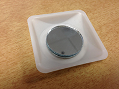
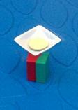
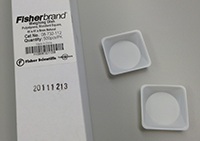
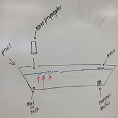
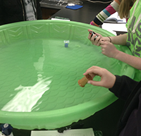
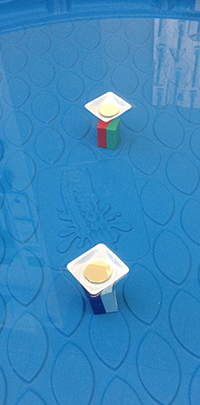
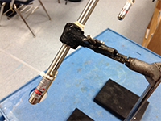
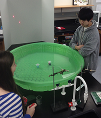

[TOC] 

_RET Fellow: Kathleen Leary
MRSEC IEG Leadership Team: RET Teachers, Ben Taylor, George Lisensky, Nader Behdad, Amir Masoumi, and Anne Lynn Gillian-Daniel.
Modeling How Antennas Transmit/Receive Electromagnetic Wave Signals Using Mechanical (Water) Waves_

This lab is intended for students ages 12 -14 years at the middle school level and all ages at the high school level. Based on the materials intended for each lab set up and roles for each lab group member, the ideal audience size is 6 groups of 4 students maximum; 8 groups of 3 to 4 students would work for larger class sizes. An important factor is the location of this lab - it must be performed in a large space with multiple accesses to water, hoses or sinks. 

## TIME FRAME

**Set-up:** 60 minutes
**Activity:** Approximately five 45 minute class periods or 1 week
**Clean-up:** 60 minutes

## OBJECTIVE

After completing the activity, participants will be able to:

1. Observe how waves travel in a medium by making 	observations and connections

2. Determine the direction of a wave by taking measurements, 	performing data analysis, and application of trigonometry

3. Collaborate, brainstorm, and design or optimize a scientific 	model that demonstrates how antennas transmit/receive 	radio wave signals

## STANDARDS

**Next Generation Science Standards:
**
* 	MS-PS4-1. Use mathematical representations to describe 	a 	simple model for waves that includes how the 	amplitude 	of a wave is related to the energy in a wave.

*	MS-PS4-2. Develop and use a model to describe that 	waves are reflected, absorbed, or transmitted through 	various materials.

*	MS-ETS1-4. Develop a model to generate data for iterative 	testing and modification of a proposed object, tool, or 	process such that an optimal design can be achieved.

*	HS-PS4-5. Communicate technical information about 	about how some technological devices use the principles 	of wave behavior and wave interactions with matter to 	transmit and capture information and energy.

**ENGINEERING PRINCIPLES
**
Engineering principles such as modeling, analysis, design & optimization, demonstration, reporting, collaboration, team building, and revision are addressed in this teaching activity. The activity is meant to serve as a model for how antennas work and how radio waves travel.  There are stages that are more confining and establish clear constraints, such as the limitations of the space and the type of materials used to represent elusive electromagnetic waves that cannot be easily observed in a classroom setting. According to A Framework for K-12 Science Education: Practices, Crosscutting Concepts, and Core Ideas ( 2012 ), “The design process—engineers’ basic approach to problem solving—involves… problem definition, model development and use, investigation, analysis and interpretation of data, application of mathematics and computational thinking, and determination of solutions. These engineering practices incorporate specialized knowledge about criteria and constraints, modeling and analysis, and optimization and trade-offs.” 

_ETS1.A: Defining and Delimiting an Engineering Problem_

The wave pool model defines a problem of how antenna determine the origin of a transmitted wave. Through the use of an analogous model, the materials used in the lab serve as smaller parts of a whole concept - addressing model development. Calculating velocity and measuring change in time of two ‘antennas’ facilitates model use, investigation, collaborating, team building and reporting (of data). Interpretation of data is executed by relating time measurement averages to origin points of the propagated wave, while application of mathematics and computational thinking, and determination of solutions is performed by introducing how to use trigonometric functions to determine angle. Through use of the wave pool model, students are able to construct an apparatus that allows them to control some of their own perimeters (ex. distance between antennas and distance while measuring velocity) within the constraints of the water container. Additional limitations include understanding and visualizing the essence of how radio waves behave as they are electromagnetic and do not need matter to travel through, therefore are not easily observed in a science classroom.

_ETS1.B: Developing Possible Solutions_

Post-lab discussion of the wave pool results is an open-ended way to allow students to refine the model, evaluate their accuracy in taking data measurements during the investigation, and offer potential uses for the model.  Through analysis of the lab itself, the students can offer modifications and improvements to the model to better align it with the concepts associated.

_ETS1.C: Optimizing the Design Solution_

The lab should end allowing students to creatively design and engineer alternatives that they propose would either modify the model for other applications or improve the model. Facilitating this integral part of the engineering design process would be the ideal way to utilize the skills, tools, creatively, and understanding of the model learned during the course of the lab.

## BACKGROUND

It’s a good idea to have covered chemistry prior to this lab. Specifically, it is important that students understand atoms and how electrons behave, i.e. photons are given off after electrons are energized - when they de-energize. Knowledge of the Bohr model and energy levels is recommended. Demonstrating or even allowing the students to participate in a lab that shoes that different atoms (metals) can be heated (as to energize the electrons) and as they de-energize the photons can be seen as different wavelengths of visible light (see Flame Tests Lab in Supplemental Materials).  However the teacher would like to introduce the EMS would work, but it is crucial the students have some understanding of the nature of electromagnetic waves. Examples of lessons and teaching materials that can be used are listed under ‘Supplemental Materials.’

## MATERIALS

The following list of materials applies to an individual lab set up. The total quantity for each item is shown in parentheses

*	1 - 3 ft. hard plastic wading pools  (Qty. 6 - 8) 

*	4 - rectangular “Super Magnet” plastic covered magnets 	(Qty. 24 - 32)

*	1 - tape measure  (Qty. 6 - 8) 

*	2 - stopwatch timers (Qty. 12 - 16) 

*	1 - wave generator (spool or upside down cup with a lip or 	ridge)

*	2 - mirror ‘antenna’ boats w/ washers and weigh boats 	(see set up) (Qty. 12 - 16) 

*	Water and syphon tubes

*	Metric ruler, calculator, protractor and pencil

*	Nut or bolt “marker”

*	2 lasers with batteries (Qty. 12 - 16) 

*	2 ring stands with test tube clamps (Qty. 12 - 16) 

*	1 tri-fold poster presentation white board (Qty. 6 - 8) 

*	plastic zip ties (Qty. 24 - 32)

*	Antenna Unit Handouts #1, #2 and #3

**SUPPLEMENTAL MATERIALS**
*	Structure of the Atom - notes 

* Flame Tests Lab: Identification of Metallic Ions

*	Atomic Physics & Laser Spectroscopy - notes 

*	Touring the Electromagnetic Spectrum - NASA Wksht

*	Synchrotron Investigations - Microwave Lab

*	Radio Wave Signals & Antennas - notes

*	Antenna Handouts #1, #2, and #3

*	Biomimetic Wave Pool Presentation

*	http://chemistry.beloit.edu/edetc/cineplex/	biomimetic_wave/

## SET-UP

**Set-up - Material Prep for Part 1**

The ‘mirror antenna boats & anchor magnet’ set ups require a small amount of prep work. To make one antenna boat you need a dry chemical weigh dish, a flat, metal washer and round, 1 inch diameter craft mirror and some adhesive (poster tack or a little hot glue will work.)  Also, to prepare the pools, you will need to fill them all to a depth of 8.5 to 10 cm., which works best for the magnets to make a strong enough connection to the mirror boat to keep it aligned but not sucked under the water.)

     

**Set-up - Part 1 “Velocity”**

The students will place one of the mirror boats in a spot at a fixed distance away from the wave propagation point marked by either a bolt, nut or some heavy marker. Students choose distance.

   

**Set-up - Part 2 “Measuring Change in Time of Transmitted Wave”**

In order to take the time difference a wave hits to points for calculating the origin of the wave, there must be two antenna boats. The distance at which these to antenna boats are stationed a part should be fixed - and while each group may choose their own distance, it is best for calculating class averages if the distance between the two boats is the same for the entire class.  To better ‘see’ the generated wave hit the two boats, a laser set up will be required. This includes a laser, a plastic zip tie to hold down the laser ‘on’ switch, a clamp and a ring stand. The set up requires two lasers per pool - one for each antenna boat. The laser should be place so the beam reflects off the mirror onto the white presentation board. Stopping the timer is easier when looking at the first movement the lasers make on the white background.

      

**Introduction: “Connecting the Model to the Behavior of Radio Waves” (45 min)**

It is necessary to restate the purpose of the lab before you start your activity. Clarifying the purpose is important because the original reasons are likely to get muddled by doing such a model-heavy lab. Students will likely start thinking the lab is about water waves, because that is what is being used. This will be more true of middle school students than high school students.  It is important to have the students visualize what the lab is meant to demonstrate. This can be accomplished through pre-lab setup drawings of the lab and drawings of how radio waves move through space since we can not ‘see’ them (as they do not need matter.) Pose the questions: How can antennas determine the origin of a signal? What engineering elements might be required in order to calculate the direction of the radio transmission? [The students should have already been exposed to the basics of electromagnetic wave behavior as a whole, including the fact that EM waves all move at a constant speed of light. The only variables of a wave that fluctuate and then determine the type of electromagnetic wave that it is, are frequency and wavelength. Amplitude can change also, but it is a characteristic that does not change the speed of a wave. (This is a misconception about wave speed with students and should be clarified.)]

The students can start working through Antenna Unit Handout #1 - Part A. Afterwards, the students should go to their lab tables and assist with the set up. They should get their lab notebooks ready by reading ahead to Part C as they must recreate a table with at least 10 trial entries.  The teacher should draw out the diagram (shown above in Part 1 - “Velocity”) on the board for students to copy in their lab notebooks. Students will then make qualitative and quantitative observations about how water moves when making ripples, completing Part B of the handout. The students should be prepared for the lab the following day. 

## HANDS-ON

**Hands-On Lab: Part 1 “Calculating the Velocity of Water Waves” (45 - 60 min)**

_Establishing a Fixed Distance_

In order to use the measurements taken in Part 2 (below) to calculate average Δt a wave will hit two points at any given angle, the lab group must FIRST establish a constant velocity (representing the constant (C) speed of light of all EM waves.) The students are to set up their wave pool model to have the largest distance possible between the mirror boat and the marker for the location of the source wave. They will measure the distance and record it for calculating velocity after performing the 10 time trials. 

_Assigning Roles_

There should be one wave generator/data recorder and two students timing. Part of the skills required for this lab are to be comfortable using a timer/stopwatch. There are a number of ways to take time between two points - one person can start their timer and press ‘lap time’ twice, one for when the wave is generated and one for when the wave hits the mirror boat. The ideal way to have student collaborate and use team work is to assign each point to one student, thus each student will have a timer. The students can then only focus on their points rather than needing to look at two different points in a relatively small area. Reaction time will vary, but with practice the students can learn to stop their timers at the moment a wave hits - the same way every time. This is a good time for the teacher to talk about consistency and human error due to varying reaction times.

_Making the Wave_

The wave generator has the additional task of managing the pool, the data and the timers. The pool should be still and students should try not to touch it as to avoid small disturbances in the water. The wave generator will make one wave for the timers to measure. The waves should be made directly over the marker to ensure the fixed distance is being maintained. Between each trial the pool must be stilled.

_Synchronizing for Taking Time_

The students will synchronize their timers - meaning they will start their timers at the same time. Students are not always clear what this means and many will keep their timers at zero and start them when the waves hit. This may work if they are very good at stopping their timers at the same time and then calculating the distance. An easier way is for the two students to start them together, then when the wave generator makes the wave the student assigned to that point will stop the timer and the other student will stop their timer when the wave hits the mirror boat. The time difference is the time the wave traveled and will be used later with the distance to calculate velocity. This should be done at least 10 times. The lab groups can then write on the board each of their groups averages (leaving out measurements outside an appropriate range.) The class can then compare their averages with other lab groups and a class average for speed (constant velocity) that waves travel in water can be determined. This is a good time to talk about how scientists pick appropriate ranges in data for more accurate results, which entails leaving out numbers that are out of range of the median range.

**Pre-Lab:  Part 2 “Measuring Change in Time of Transmitted Wave”  (45 min) **

_Inquiry_

Students will now work through Antenna Unit Handout #2. This handout will introduce the idea that in order to determine direction there needs to be at least to points receiving a signal. An analogy can be used with sound and animals’ abilities to hear and determine origin. The teacher can elicit ideas about how to change the model so that we can test the hypothesis that two points can help us calculate the origin. If time is an issue, addressing this relationship can happen after the lab. 

_Lab Set-up_

The lab groups have established a constant velocity of water waves (representing the constant (C) speed of light of all EM waves.) Now the model needs to change to represent an antenna that has two receiving monopoles. The teacher can either ask the students to set up the new model by drawing a diagram on the board or have the pools set up prior to class. The class will add an antenna boat and place both boats in the center at a fixed distance apart. (It is best to have the entire class use the same distance as they will be comparing their averaged group results to those of the class.) The ‘marker’ (nut or bolt or penny, dime or quarter) will need to be placed at 0°, 45°, and 90°.  This will give the students a benchmark for how waves move and hit receivers at different points of origin. Students should prepare for that activity by creating a table in their lab notebooks with 10 trial entries for each angle (see Part C of Antenna Handout #2).

_Lasers & Amplification _

The lasers are not a necessary part of the lab, but they make noticing the movements of the mirror boats much easier. The students should set up two lasers pointing directly at the mirror boat so that it will reflect onto the board. The timers will watch the first movement of the laser they are assigned to in order to know when to stop their timers. 

**Hands-On Lab: Part 2 “Measuring Change in Time of Transmitted Wave” (45 min)**

The students will adjust their roles and locations of where they will be taking time. After synchronizing their timers, the time keepers should look only at their laser reflection. Calling each boat/laser combo T1 and T2 comes in handy later when they are calculating for Δt. The wave generator will continue to manage the pool and the timers. Students will think they need to record the time between when the wave generator starts the wave and when it hits one or both of the two boats, but this is not the case. The class has already determined velocity, so all that they should be concerned about is measuring the time difference it takes for a wave to hit each boat. Students should do this 10 times for each angle. They will average their times and put on the board for comparison.

**Analysis & Math Application: “Using Trigonometry to Calculate Origin of Waves” (45 min)**

The students will notice a pattern when comparing the time differences of each angle, but they will not understand fully until they can see how to use this number to determine the angle of the origin. Trigonometry is difficult for middle school students, but if the teacher demonstrate how to use the math, they will see that the measurement has a purpose and is useful. A conversation about how antennas have use technology that use this sort of algorithm to determine origin of a signal. Important to mention that true triangulation occurs when there are three data points.

## CONCLUSIONS
45 min

**Extension**

The students may test the model to see if it works. By dropping markers in at different points relative to the two mirror boats, the students make take the time measurements and use trigonometry to calculate the angle of the origin of the wave. Review Antenna Unit Worksheet #3 for more information.

**Application**

It’s best if the students are able to see this how this model has been applied. Talking about the module’s development based on a biomimetic fly is a great way to connect the lab activity to real-life engineering applications (see Biomimetic Wave Pool Presentation in ‘Supplemental Materials’).

## ASSESSMENT

There are a lot of formative assessment questions the teacher can ask to ensure understanding. A final assessment could be a math question that assesses their ability to determine an angle based of a series of time differences. Another assessment is to have a completed lab notebook with an discussion that address the following points: 

1.	Explain your results for both velocity and change in time.

2.	Support your analysis with examples from evidence - your own data and that of the class. 

3.	Error analysis (This should be a detailed account of why the data was off, what parts of the lab when wrong and why.)

4.	Why is this data significant? (What does it help us do, understand or show us?)

5.	Suggestions for future applications or changes to be made for improved modeling.

## REFERENCES

http://missionscience.nasa.gov/ems/
http://www.physicsclassroom.com/
http://www.clt.uwa.edu.au/
http://directory.engr.wisc.edu/ece/faculty/behdad_nader

