[TOC]

## INTRODUCTION

Families of semiconductors can be incorporated into devices that emit light over much of the visible spectrum upon electrical excitation. These light emitting diodes (LEDs) and diode lasers are revolutionizing many communication and display technologies. The wavelengths of light emitted can be controlled using design principles based on the periodic table, including isovalent element combinations and solid solutions. A recent technological breakthrough is the blue LED, which permits additive color mixing when combined with green and red LEDs.

Light emitting diodes are composed of a chip of semiconductor mounted on one lead with a gold wire connected to the other lead. A plastic lens protects the semiconductor and focuses the light.

The term "diode" refers to the fact that unlike a normal light bulb, which will light up when electricity flows through it in either direction (by, e.g., hooking it up to a battery in either direction), the LED will only light up when electricity flows in one direction because of the electric fields that are present in the interior of the device.

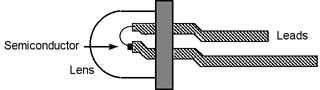

A simple circuit can be constructed with the LED, a 1K ohm resistor and a 9-volt battery. The resistor limits the amount of electrical current flowing through the diode so that it doesn't overheat, which can destroy it.

## HOW

How do they Work?

## BAND THEORY

As described below, simple chemical bonding ideas can be used to provide a qualitative understanding of how the color of light emitted by an LED is tuned by changes in the semiconductor's chemical composition.  The following is a brief review of the band theory under pinning these devices. 

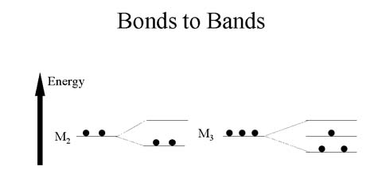

When two atoms bond together to form M2, two molecular orbitals are formed. When three atoms bond together to form M3, three molecular orbitals are formed.

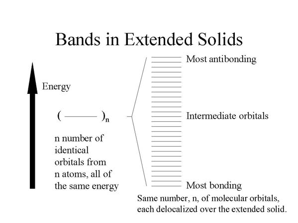

In the extended solid, many atoms interact with one another, and there will be the same number of molecular orbitals, delocalized over the entire solid, as the number of atomic orbitals being combined. The energy separation of the orbitals is so small from one such delocalized orbital to the next that they comprise a so-called "band." The band represents a kind of electronic highway allowing electrons to move throughout the solid, thereby conducting electricity. For this to occur, however, the band cannot be empty or filled with electrons. Only if the band is partially filled can a net flow of electrons occur, corresponding to an electrical current.

The band containing the valence electrons is known as the valence band. The band of unoccupied orbitals is known as the conduction band. Conduction occurs when electrons are promoted from the valence band to the conduction band, where they can move throughout the solid. The energy separation between the valence and conduction bands is known as the bandgap energy.

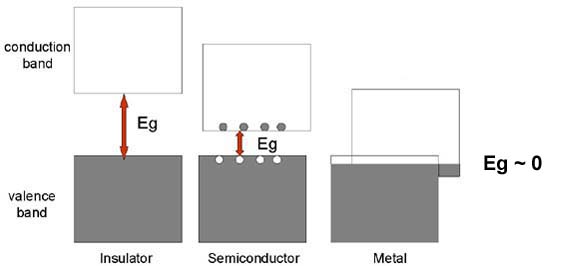

The band gap energy, Eg, shown as the double-headed arrow, is the separation between the top of the valence band and the bottom of the conduction band. The size of the band gap decreases in passing from aninsulator to a semiconductor to a metal, where it is effectively zero. Electron-hole pairs are shown for a semiconductor as filled circles (electrons) in the conduction band and open circles (holes) in the valence band.

## SPECTRA

Absorption spectrum:

A wide range of energies can cause electrons to be excited from the valence band to the conduction band (absorption; figure shows electronic transitions, A, and corresponding absorption spectrum, B).

Emission Spectrum:

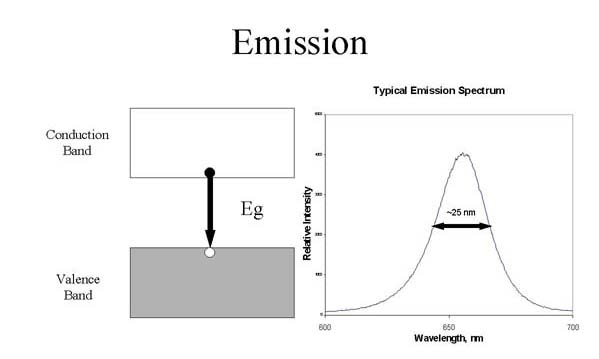

Excited electrons will drop from the bottom of the conduction band into the top of the valence band with the emission of light with a very narrow band width (emission; figure shows an electronic transition, A, and corresponding emission spectrum, B).

## Semiconductor 

Semiconductor Materials

Semiconductors are typically prepared from combinations of elements having crystal structures related to that of diamond and the same average number of valence electrons per atom as the atoms in diamond.

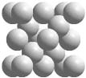 

_ Diamond Unit Cell_

Crystals of carbon, silicon, germanium, and the alpha form of tin from Group 14 of the periodic table all have the diamond structure, whose unit cell is shown above. The diamond unit cell contains all atoms of the same element arranged in a tetrahedral geometry.

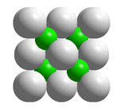

_Zinc blende unit cell_

Crystals of carbon, silicon, germanium, and the alpha form of tin from Group 14 of the periodic table all have the diamond structure, whose unit cell is shown above. The diamond unit cell contains all atoms of the same element arranged in a tetrahedral geometry.

Many complementary pairs of atoms with 1:1 stoichiometry (AZ) and the same average number of valence electrons per atom as the atoms in Group 14 such as ZnS, GaAs, and ZnSe have the zinc blende structure, asshown above. In zinc blende unit cells, there are atoms of two elements,each arranged in a tetrahedral geometry and bonded exclusively to the other kind of atom.

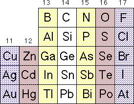

_Portion of the periodic table emphasizing the
formation of 1:1 AZ solids that are isoelectronic
with the Group 14 solids.Complementary pairs
are indicated with similar shading: for example
Ge, GaAs, ZnSe, and CuBr._

_Solid State Solutions_

Solid state solutions of three and four elements are commonly used inlight emitting diodes. In cases of 1:1 stoichiometry such as GaAs, Al canbe substituted for a fraction of the Ga or P can be substituted for afraction of the As, thus producing Al1-xGaxAs orGaP1-xAsx semiconductors, respectively. Fourelements can even be combined to produce Al1-xGaxPyAs1-y.

 Substitutional solid solutions A1-XZX with varying stoichiometries(varying values of x).
 
 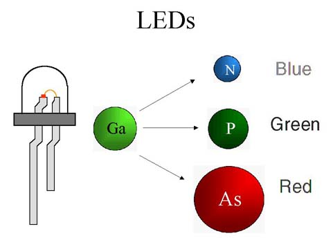
 
 Blue light is emitted by LEDs containing In, Ga, and N, while GaP LEDsemit green light and and LEDs containing Ga, P and As emit red light. Light emitting diodes can be made that are solid phase solutions of threeelements, GaP1-xAsx, where x varies from 1 to 0.For x equals 0.6, the LED is red. The LED emits orange light when xequals 0.35. For x equals 0.15, the LED emits yellow light. Green lightis emitted when x = 0, i.e., LEDs with a composition of GaP.

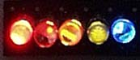

_ LED strip of red, orange, yellow, green, 
and blue LEDs._

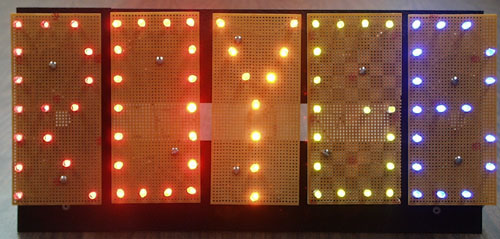

_ Letters outlined using red, orange, yellow, green, and blue LEDs._

The band gap energy can also be described qualitatively in terms ofchemical bonds. The band gap energy can be regarded as the energyrequired to free an electron from a bond in the solid, enabling it tobecome mobile and thus contribute to electrical conductivity. Connectingthe LED to a battery in an electrical circuit provides a source of energyto liberate electrons from their bonds. When some of the electrons returnto restore bonds, roughly the band gap energy is liberated, as this is thereverse of the process used to create mobile electrons that requiredenergy. Some of the energy released is in the form of light. Thus, formany LEDs the color of light is a rough measure of the band gap energy ofthe semiconductor comprising the LED.

The band gap energy can be tuned by varying the chemical composition ofthe semiconductor. Considering first solids with the diamond structure,there is a smooth variation in electrical conductivity in descending theperiodic table. In diamond itself, the carbon atoms are relatively smalland close to one another so that the bonding electrons are held verytightly by the atoms. This corresponds to a large band gap energy andpoor electrical conductivity. Indeed, diamond is a superb electricalinsulator. In passing to silicon and germanium, the atoms are larger andfarther apart, and the bonding electrons are held much less tightly. Thiscorresponds to a smaller band gap energy and a larger pool of mobileelectrons at room temperature, corresponding to semiconductor-likeconductivity. Finally, with tin, the atoms are yet larger and fartherapart. The band gap energy for tin is very small and the largeconcentration of mobile electrons corresponds to metallic conductivity.

For many combinations of elements in compound semiconductors, the trend inband gap energy can be qualitatively predicted based on interatomicdistance, with, as noted above, shorter bonds corresponding to larger bandgap energies. As the illustration shows, pairing Ga with As, P, andfinally N leads to a progressive reduction in bond length and acorresponding increase in band gap energy and LED color. This family ofsolids, in fact, permits tuning of the band gap energy from the nearinfrared (GaAs) to the red (As-rich solid solutions of GaAsxP(1-x)) to the green (GaP) and most recently to the blue (GaN).

## PREPARATION

The design and preparation of LEDs exemplifies exquisite control both of chemical composition and materials growth, resulting in devices with tailored electro-optical properties. Techniques like organometallic vapor phase epitaxy (OMVPE, also known as metalorganic chemical vapor deposition, or MOCVD) provide kinetically-controlled growth of semiconductor layers, which can be used to localize and optimize radiative recombination of electrons and holes in the solid. As noted above, the chemical composition of the layers controls their band gap energy and thus the color of light associated with the emitted photons that result from radiative recombination.

The group 13-15 semiconductors (called III-V semiconductors by researchers in the field) comprising the layers of LED dies are produced through co-decomposition of group 13 and group 15 precursor gas molecules. For example, using highly purified gases like trimethyl gallium and arsine, a layer of semiconducting GaAs can be formed by the decomposition of the gases on a heated substrate, according to equation 1:

(CH3)3Ga(g) + AsH3(g) ---> GaAs(s) + 3 CH4(g) (1)

Simple Chemical Vapor Deposition (CVD) is nicely illustrated on a webpage created by Hsin-Tien Chiu.

Such growth techniques permit chemical composition to be altered virtually in an atomically abrupt manner by changes in the concentration and composition of the gaseous precursors. A more general, unbalanced equation for tuning chemical composition is eq 2, where the value of n can be 0, 1, 2, and 3, reflecting the composition of species derived from the trialkyl precursors that are present under growth conditions:

x (CH3)nAl(g) + y (CH3)nGa(g) + z (CH3)nIn(g) + PH3(g) ---> AlxGayInxP(s) + CH4(g) (2)

The product subscripts indicate that these materials form a family of solid solutions, possessing, in this case, a common cubic zinc blende crystal structure but variable composition with (x + y + z) = 1. Typically, chemical compositions that are nearly lattice matched are used so that the atomic layers continue to grow epitaxially and defects are minimized.

Metal oxide chemical vapor deposition for a blue diode laser.

Science Watch in their January/February 2000 issue has information about the [Blue Laser Diode](http://archive.sciencewatch.com/jan-feb2000/sw_jan-feb2000_page3.htm) and an interview with [Shuji Nakamura](http://archive.sciencewatch.com/jan-feb2000/sw_jan-feb2000_page4.htm), the man who produced the first blue LED.

[Lumileds](http://www.lumileds.com/technology)  has a nice presentation of the improvements in LEDs in recent years.

## BLUE LED CIRCUIT 

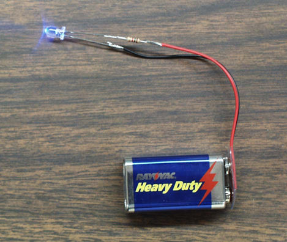

 The circuit for lighting a blue LED is a very easy circuit to build.

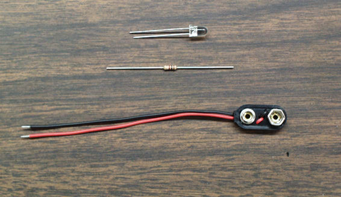

It consists of the blue LED, a 1K ohm resistor, and a 9-V battery clip. 

LEDs have one lead longer than the other. This long lead must be connected to the (+) terminal of the 9-V battery using the clip leads.One lead of the clip should have the 1K ohm resistor soldered to it and the opposite end of the resistor soldered to the LED, as shown below.

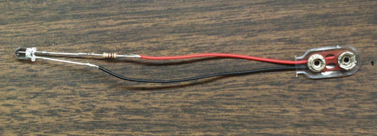

## OLEDS 

Organic Light Emitting Diodes

Organic light emitting diode arrays are showing great promise as replacements for liquid crystal displays. The OLEDs offer the advantage of emitting light whereas the LCDs have to be back lit. This is an excellent example of nanotechnology.

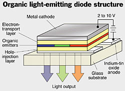

_Basic OLED design
Copyright Chemical & Engineering
News, June 26, 2000 _

The OLED is composed of one or more specialty organic/polymer materials between two electrodes, one of which is transparent. Applying a voltage across the electrodes causes holes and electrons to be created. Light is emitted when these electrons and holes recombine. The color of light is dependent on the organic/polyer compounds involved. Full color OLED panels can be created by using a combination of red, green, and blue sections, as shown above.

OLEDs show promise for replacing some applications for LCDs. Since the molecules emit light, there is no need for backlighting the display, saving tremendously on power. The light emitted varies in color. The use of red, green, and blue emitting polymers eliminates the need for the filters needed in full color LCD displays.

The promise of the use of OLEDs in large color televisions has not lived up to the hype. The half-life of the blue OLEDs is still too short for this application. However, full displays for user products that are expected to be replaced in a few years with newer/better versions, such as cell phones, music players, digital camera displays, etc., are being produced. In the mean research continues on the blue OLEDs to get longer half-lifes, the length of time for the luminance emitted to decrease to half of its original value.

[Kodak](http://www.kodak.com/global/mul/nav/econtent/access-denied.jhtml?_requestid=1966) describes what they are and their attributes.

[Universal Display Corporation](http://oled.com/) describes the materials involved and related technologies: TOLED, FOLED, and PHOLED . They also describe their latest developments.

["Coming soon to a laptop near you"](http://www.economist.com/node/1841020?story_id=1841020) describes recent developments in OLEDs in laptop computer monitors.

## APPLICATIONS 

LEDs are being used increasingly where low power consumption and long lifetimes are important. Here are a few examples. If you have seen other applications you would like to share, please send your digital image to: mcondren@cbu.edu. If you do not have a digital camera or scanner, send us your print and we can scan it.

Prints should be sent to:

Prof. Mike Condren
Department of Chemistry
Christian Brothers University
650 East Parkway South 
Memphis, TN 38104 

## EXAMPLES

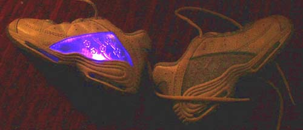

These Laser Lights brand shoes feature
red, yellow, and blue LED illumination. 

Bi-color LEDs as used in programmable message boards.
The bi-color devices contain both a red and a green chip.
When the red and green chips are turned on simultaneously, they produce a yellow color. 

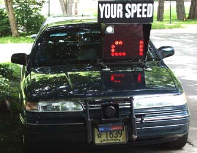

Radar unit of Shorewood Hills, WI Police Department which displays your speed in arrays of red LEDs. 

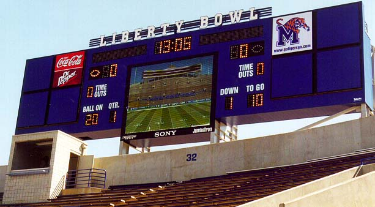

 New Sony JUMBOTRON Instant Replay screen 
Liberty Bowl Stadium in Memphis, Tennessee.

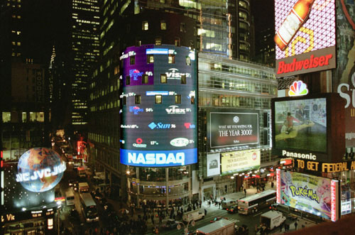

©Copyrght 1999, The Nasdaq Stock Market, Inc. Reprinted with the permission of The Nasdaq Stock Market, Inc.
 It claimed that this is the world's largest LED array, at 120 x 90 feet and 18 million LEDs.
 
 It claimed that this is the world's largest LED array, at 120 x 90 feet and 18 million LEDs.
 For a live view, see the [Webcam](http://business.nasdaq.com/discover/Nasdaq-at-Times-Square/index.html#webcam)
 
 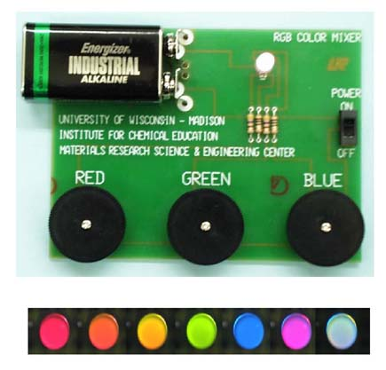
 
The Rainbow LED Board

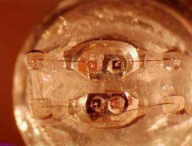

 Microscopic view of tr-color LED with plastic lens removed.
 
 The LED on this board contains four semiconductor chips: 1 red, 1 green and 2 blue chips. The red, green and blue colors are controlled independently, allowing a rainbow of color possibilities. Yellow can be created by mixing red and green; cyan by mixing green and blue, and magenta by mixing red and blue. White light can be created by mixing red, green and blue equally.
 
 For more information about color mixing, visit the web site of [General Atomics Sciences Education Foundation](http://www.sci-ed-ga.org/education-resources-top).
 
 ## BRAKE LIGHTS
 
 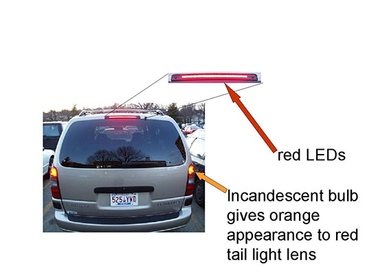
 
 The brake light on this van uses LEDs, while the tail lights use incandescent bulbs.

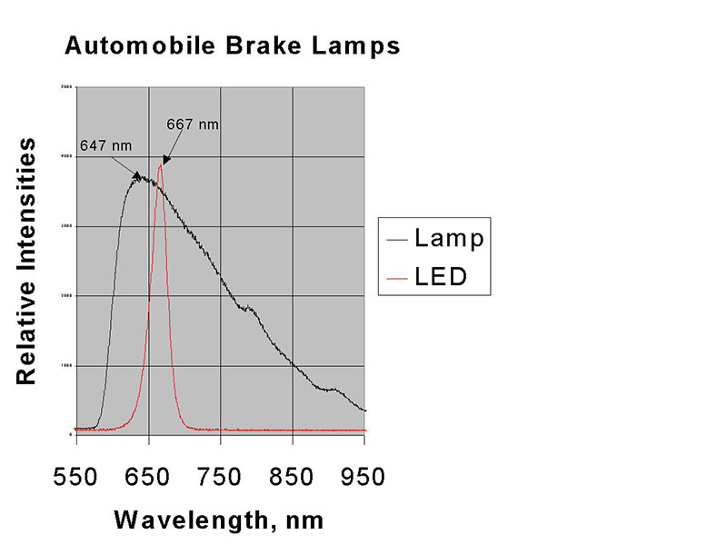

The LEDs show a peak in their spectrum at 667 nm. The tail lights use incandescent bulbs and show a peak in their spectrum at 647. Thusthe LEDs are appear redder.

All of the newer city buses in Madison have LEDs on the rear as brake and tail lights, as well as turn signals.

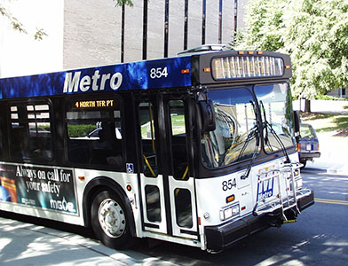

The newest buses have all of the external lighting, except the headlights, as LEDs. This includes the destination boards on the front and right side and the route number on the right front and rear of the bus.

Medium size truck are also using LED tail/brake lights such as this FedEx truck in Chicago.

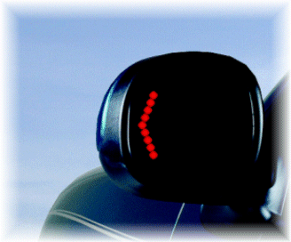

 Signal®Mirror Safety Systems.
Signal®Mirrors are a registered trademark of K.W. Muth Co.Inc.
Picture is used with permission from K.W. Muth Co.Inc.

K.W. Muth Co. Inc. is manufacturing Signal® Mirrors that use LEDs in the side view mirrors. These appear as original equipment on some pickup trucks, sports utility vehicles, vans, and motorcycles. Their Wide Angle Signal® Mirror Kit can be fitted to any vehicle.

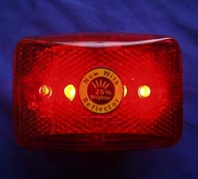
 
 LED flashers for bikes
 
 LEDs are being used increasingly where brightness, low power consumption, and long lifetimes are important safety concerns. Another advantage is that, if one element fails, the whole assembly does not stop working. As described in the Hewlett-Packard press release cited below, LEDs illuminate 200 milliseconds faster than conventional incandescent lamp, giving the driver of the trailing vehicle one car length greater stopping distance at 65 mph.

TRAFFIC LIGHTS 

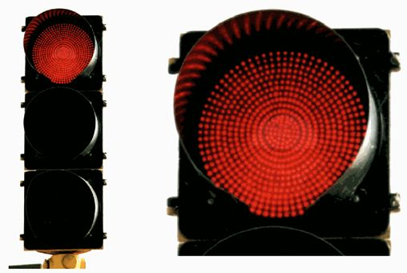

 How many LEDs are in this red traffic light

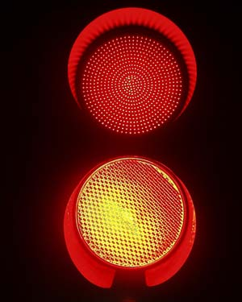

Note the  difference in the color between the LEDs on top and the incandescent bulb/red lens on bottom.

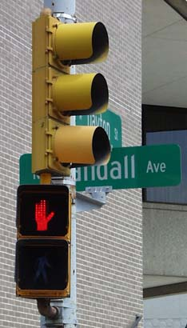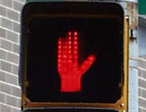

 LED "Do Not Walk" indicator.
For more information on traffic light applications, see the [MRSEC Traffic Light Web page](http://education.mrsec.wisc.edu/background/LED/traffic_light/index.htm)

http://education.mrsec.wisc.edu/background/LED/traffic_light/index.htm

 Railroad crossing flashers using LEDs. Use this link for more information about [Railroad Applications of LEDs](http://education.mrsec.wisc.edu/background/LED/railroad/index.htm).
 
 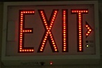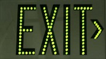
 
  Exit signs 

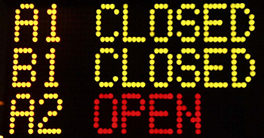

Each dot is a cluster of LEDs. Parking Information John Wayne Airport Orange County, CA 

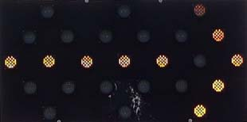

 Each dot is a cluster of LEDs. Construction Site Traffic Arrow Orange County, CA
 
 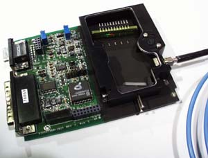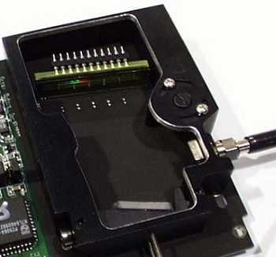
 
 Linear arrays of photo-diodes are being used as detectors in spectrophotometers such as this model by [Ocean Optics](http://www.oceanoptics.com/homepage.asp). In this particular device, the light enters the detector through the fiber optic cable to the right. The light is dispersed by the grating at the bottom of the device and detected by the array of photo-diodes near the top. For more information about diode arrays and charge coupled devices, see [Charge Coupled Devices](http://education.mrsec.wisc.edu/background/CCD/index.html).
 
## REFERENCES 

* [Teaching General Chemistry: A Materials Science Companion](https://global.oup.com/academic/?cc=us&lang=en&),by A. B. Ellis, M. J. Geselbracht, B. J. Johnson, G. C. Lisensky, W. R. Robinson.

* [Click here for updated supplier information for the materials mentioned in the book.(http://education.mrsec.wisc.edu/supplies/supplier.html)

* [Solid State Resources - a CD/ROM](https://www.chemedx.org/jce-online/jce-software) available from JCE:Software

* Kansas State University Physics Education Group [Tutorials](https://perg.phys.ksu.edu/vqm/online/index.html) and [COMPUTER SIMULATION OF P-N JUNCTION DEVICES](https://perg.phys.ksu.edu/papers/sds/SDSPaper.htm)

* George C. Lisensky, S. Michael Condren, Cynthia G. Widstrand, Jonathan Breitzer, Arthur B. Ellis, "LEDs Are Diodes", J. Chem. Ed..Vol. 78, 1664A(2001).

* S. M. Condren, G. C. Lisensky, A. B. Ellis, K. J. Nordell, T. F. Kuech, and S. A. Stockman, "LEDs: New Lamps for Old A Paradigm for Ongoing Curriculum Modernization", J. Chem. Ed., Vol. 78, 1033(2001).

* D. J. Campbell, T. F. Kuech, G. C. Lisensky, J. K. Lorenz, M. S.Whittingham, A. B. Ellis, "The Computer as a Materials ScienceBenchmark." J. Chem. Educ. Vol. 75, 297(1998)

* A.B. Ellis, "Elements of Curriculum Reform: Putting Solids in theFoundation," J. Chem. Ed., 74, 1033 (1997)

* R. A. Pounce and D. P. Bour, "Nitride-based semiconductors for blue andgreen light-emitting devices," Nature, 386, 351, 27 March 1997.

* G. B. Stringfellow and M. George Craford, "High Brightness Light EmittingDiodes", Semiconductors and Semimetals Vol 48, Academic Press, San Diego,CA, 1997.

## LUMILEDS

[LumiLeds](http://www.lumileds.com/) is a major manufacturer/supplier of LEDs.

LumiLeds Lighting is a joint venture between Agilent Technologies(formerly HP) & Philips Lighting. 

## DISTRIBUTORS

Distributors of LEDS

* [Arrow Electronics](https://www.arrow.com/)
* [Future Electronics](http://www.futureelectronics.com/WebsiteLanding.aspx)

## ONLINE REFERENCES

* AlInGaP LEDs: http://www.tms.org/pubs/journals/JOM/9709/Steigerwald-9709.html (III-V Nitride Semiconductors for High-Performance Blue and Green Light-Emitting Devices )

* Blue LEDs: [Build a Better CD Player: How Can You Get Blue Light from a Solid?](http://chemistry.beloit.edu/BlueLight/) Module written by George C. Lisensky, Arthur B. Ellis, Herbert Beall, DeanJ. Campbell, and Joanne Stewart. Quicktime Movies by G. C. Lisensky and J. M. Blackwell

* [Don Klipstein's LED Main Page](http://donklipstein.com/ledx.html)

* [Dialight Corporation](http://www.dialight.com/FileNotFound/index) develops and markets LED lighting systems for trucks, buses, and traffic signals.

* [LEDs: From Indicators to Illuminators?](http://www.lrc.rpi.edu/programs/transportation/led/index.asp)

* Non-silicon LEDs?

* Outdoor lighting:
* * [Very Large-Screen Video Displays](http://www.conceptron.com/articles/very_large_screen_displays.html)
* * [Smartvision Large Area Displays](http://www.lsi-industries.com/smartvision-new/)

* Polymer Light Emitting Devices: [More Information about Polymer Electronics](https://courseware.ee.calpoly.edu/~dbraun/polyelec/moreinfo.html)

* Traffic Lights: [Optimizing the Design and Use of Light-Emitting Diodes for Visually Critical Applications in Transportation and Architecture](http://www.lrc.rpi.edu/programs/transportation/led/index.asp)

## OLEDS

* ["Enhancing the Efficiencies, Color Purities and Lifetimes of Organic Light Emitting Diodes"]() Mark E. Thompson, Chemistry Department, University of Southern California, Los Angeles, CA 90089-0744, presentation at the LED Symposium at the San Diego ACS National Meeting April 1, 2001.

* ["Opportunities for chemists in organic LEDs and other display technologies"](http://education.mrsec.wisc.edu/index.htm) Daniel J. Gisser, Eastman Kodak Company, 1999 Lake Avenue, Rochester, NY 14650-2138, presentation at the LED Symposium at the San Diego ACS National Meeting April 1, 2001.

* [An Easily Prepared Organic LED Using Ru(bpy)32+](http://education.mrsec.wisc.edu/background/OLED/OLED.pdf) by Jonathan Breitzer and Joel Hassenzahl LED fabrication procedure modified from Frank G. Gao and Allen J. Bard, "Solid-State Organic Light-Emitting Diodes Based on Tris(2,2'-bipyridine)ruthenium(II) Complexes", Journal of the American Chemical Society, 122(30), 7426-7427 (2000)
[Ru(bpy)3](BF4)2 synthesis modified from John A. Broomhead and Charles G. Young, Inorg. Syn. 28, 338-340 (1990).

 

 

 
 

  
  

