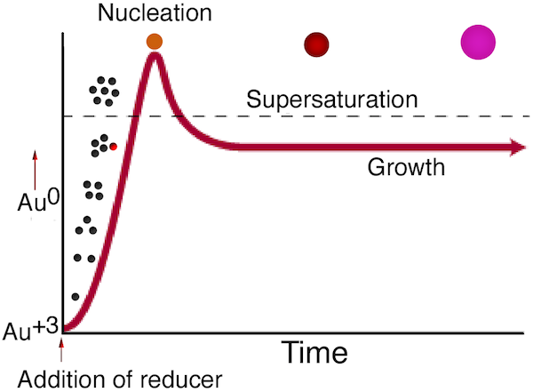

[TOC]

_The synthesis procedure shown here is from A. D. McFarland, C. L. Haynes, C. A. Mirkin, R. P. Van Duyne and H. A. Godwin, "Color My Nanoworld," J. Chem. Educ. (2004) 81, 544A. The electrolyte analysis of sports drinks was developed by Andrew Greenburg._

Properties of materials change at the nanoscale. In bulk at the macroscale, the element of gold is gold colored, but at the in particles nanoscale, the element of gold is red to purple in color. The formation of gold nanoparticles can be therefore observed by a change in color since small nanoparticles of gold are red. The layer of absorbed citrate anions on the surface of the nanoparticles keep the nanoparticles separated, and the presence of this colloidal suspension can be detected by the reflection of a laser beam from the particles. Switching to a smaller anion allows the particles to approach more closely and another color change is observed. 

## SAFETY
* Wear Eye Protection
* Chemical Gloves Recommended
* Never look directly into a laser or shine a laser at another person

## MATERIALS

Stock solution for 25 batches

* 1.0 mM hydrogen tetrachloroaurate: The solid is hygroscopic so purchase HAuCl4.3H2O (Aldrich 244597 or 520918) in 1.0 g quantities and use the entire bottle. Dissolve 1.0 g HAuCl4.3H2O in 250 mL distilled water to make a 10.0 mM stock solution of gold(III) ions that can be kept for years if stored in a brown bottle. Dilute 25 mL of stock to 250 mL to make the 1.0 mM concentration for this experiment.

* 1% trisodium citrate: Dissolve 0.5 g Na3C6H5O7.2H2O (sodium citrate) in 50 mL distilled water.

* NaCl solution: Dissolve at least 0.5 g of NaCl in 10 mL distilled water or use a saturated solution.

* Optional sports drinks: Gatorade Ice, Powerade, Flavorless Pedialyte, Pickle Juice. Colorless or as little color as possible work better.

## EQUIPMENT
* 50 mL Erlenmeyer flask or beaker

* 1" or 1 cm stir bar

* Stirring hotplate

* Laser pointer, polarizing filter

* Droppers and test tubes or cuvets

## PROCEDURE
* **Step 1. **

   Rinse all glassware with pure water before starting. Add 20 mL of 1.0 mM HAuCl4 to a 50 mL beaker or Erlenmeyer flask on a stirring hot plate. Add a magnetic stir bar and bring the solution to a rolling boil.

* **Step 2. **

  To the rapidly-stirred boiling solution, quickly add 2 mL of a 1% solution of trisodium citrate dihydrate, Na3C6H5O7.2H2O. The gold sol gradually forms as the citrate reduces the gold(III). Remove from heat when the solution has turned deep red or 10 minutes has elapsed.
  
  * (Gaps in the movie indicate equal gaps in time. The total elapsed time is approximately 10 times the movie length.)
  
  * The presence of a colloidal suspension can be detected by the reflection of a laser beam from the particles.
  
  * The light from a laser pointer may be polarized. When polarized light causes plasmon emission the beam may disappear at some angles. When the beam from the laser is visible, is it invisible in a view perpendicular to the first?

* **Step 3. **

  Record the visible spectrum of the solution. If necessary, add additional water to the cuvette to get the absorbance on scale.

* **Step 4. **

  Put a small amount of the gold nanoparticle solution in two test tubes. Use one tube as a color reference and add 5-10 drops of NaCl solution to the other tube. Does the color of the solution change as the addition of chloride makes the nanoparticles closer together?

* Option 1: this part could be done in a cuvet with the visible spectrum recorded after each addition.

* Option 2: test electrolyte content in sports drinks by counting drops needed to change the color of 7 drops of gold nanoparticle solution.

## CONCLUSIONS

Before the addition of the reducing agent, the gold is in solution in the Au+3 form. When the reducing agent is added, gold atoms are formed in the solution, and their concentration rises rapidly until the solution exceeds saturation. Particles then form in a process called nucleation. The remaining dissolved gold atoms bind to the nucleation sites and growth occurs.

    
See "Producing gold colloids" at http://www.ivdtechnology.com/article/manufacturing-high-quality-gold-sol

1. Why do more concentrated or stronger reducing agents tend to give smaller nanoparticles?

2. Why does rapid mixing of the reducing agent give more monodispersed particles?

3. What is the wavelength and fwhm (peak width at half the maximum height) of the visible absorption?

4. Summarize the evidence that you made solid nanoparticles.

5. If you tested several salt solutions, report your results and rank the solutions in order from the least to the most electrolytes.

    
    