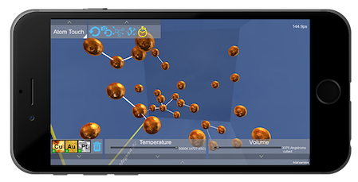
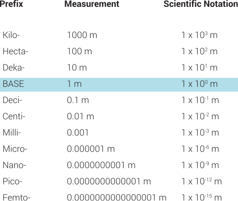
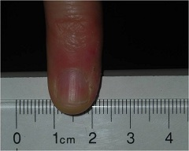
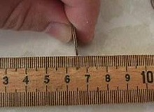
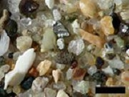
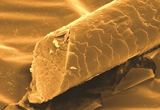
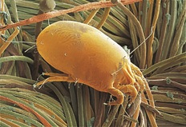
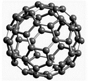
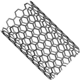
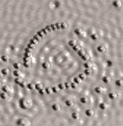

[TOC]

It is useful to know the approximate sizes of things. Is something bigger than a bread box? Will it fit through a doorway? Is it as big as it is supposed to be? These are all questions that we may find ourselves asking on a regular basis.

In Egyptian times, the length of an object was measured in cubits-one cubit corresponded to the distance from one's elbow to the tip of one's middle finger. The cubit could be divided into smaller segments, related to the size of different parts of the hand. However, it is easy to imagine that these sizes vary greatly from person to person. A cubit measured on a small child would be very different than one measured on an adult. Through the ages, measurement systems became more standardized. The two systems of measurement used today are the English and Metric System.

[Atom Touch](https://mobile.wisc.edu/mli-projects/project-atomtouch/)

In order to give students and teachers a more hands-on sense of scale, we developed the free, interactive app called AtomTouch. AtomTouch includes a size and scale introductory video, and many engaging and educational activities to give students a real sense of atomic behavior. Download it for FREE from the App Store or from Google Play.

## METRIC SYSTEM

In everyday life the English system of measurement with units like feet, gallons and pounds is primarily used in the United States. Scientists and the rest of the world use the metric system of measurement with base units such as the meter, liter and gram. The base unit is then multiplied or divided by powers of ten to represent larger or smaller measurements. Prefixes are used to relate the relative size of the measurement with respect to the base unit. Since the base unit for length is the meter the table below shows all the different prefixes that could be used to express length.

1000 meters (m) would be written as 1 kilometer (km). Other base units can be used as well. For mass, the base unit is the gram (g), so 1/100th of a g would be written as a 1 milligram (mg). Often is it hard to visualize what those numbers really mean because units in the metric systems are not something we may use in our every day life.

## KILOMETER

For those of us at UW-Madison, the distance from the edge of campus at Library mall to the steps of the Wisconsin state capitol building is 1 kilometer (km). But, there are plenty of other things around the world that are on the kilometer scale.

The world's longest suspension bridge, Akashi Kaikyo Bridge, is just under 2 kilometer (km) long, measuring 1,991 m. It would take you approximately 23 minutes to walk across this bridge. The Willis Tower in Chicago, the tallest building in North America, measures ~0.5 km (527 m) to the top of the antennae.
                                                  

## METER
A meter is a little bit bigger than a yard. A lot of things in our everyday lives are around the same size as a meter. An elementary school student is approximately one meter (m) tall. However, most professional basketball players are at least 2 meters (m) tall. Shaquille O'Neill, at 7'1", is 2.1 m tall. He seems to tower over President Bush.

                                     

## CENTIMETER
A centimeter (cm) is 1/100th of a meter. If you cut up a meter stick into 100 equal pieces, each piece would be one cm in size.

Your pinky finger is about 1 cm wide. Same goes for the width of the sugar cube.

                         
## MILLIMETER

A millimeter (mm) is 1/1000th of a meter. A dime is approximately 1 mm thick. Grains of sand range from 0.1 mm to 2 mm in size.

                                        

So far all the objects listed from kilometer to millimeter are all things that can be seen with your eyes. Some are easier to see than others, but you typically don't need a special tool to see any of these objects. When things get smaller than a millimeter, it gets hard to see them with just your eyes.

## MICROMETER
A micrometer, also called a micron, is one thousand times smaller than millimeter. It is equal to 1/1,000,000th (or one millionth of meter). Things on this scale usually can't be seen with your eyes.

The diameter of a hair, which is 40-50 microns wide, is very hard to discern without the use of a magnifying glass. A magnifying glass will help you see a dust mite. Dust mites are usually around 400 microns long.

       _ Human hair magnified 200X	_
   _ Dust mite magnified 40X_

Things that are just a few microns in size can't be seen with a magnifying glass. However, a light microscope, like the ones you may have used in biology class, can help you see things this small. Red Blood cells are 6-10 microns in diameter. Many types of bacteria typically measure 5-20 microns

         _Red blood cells magnified 1700X_	
     _Bacteria magnified ##X_

                      
## NANOMETER
A nanometer (nm) is 1,000 times smaller than a micrometer. It is equal to 1/1,000,000,000th or one-billionth of a meter. When things are this small, you can't see them with your eyes, or a light microscope. Objects this small require a special tool called a scanning probe microscope. (link to SPM page)

Things on the nanometer scale include: Virus (30-50 nm), DNA (2.5 nm), buckyballs (~1 nm in diameter), CNT (~1 nm in diameter).

     _Virus magnified 20,000X  _

      _Model of DNA_

     _Model of buckyball_

        _Model of a carbon nanotube_
 
Atoms are smaller than a nanometer. One atom measures ~0.1-0.3 nm, depending on the element.

          _SEM image of atoms on a surface_

Here are some other everyday objects measured in nanometers:
* One inch equals 25.4 million nanometers.
* A sheet of paper is about 100,000 nanometers thick.
* A human hair measures roughly 50,000 to 100,000 nanometers in diameter.
* Your fingernails grow one nanometer every second.

