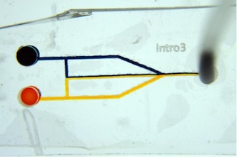
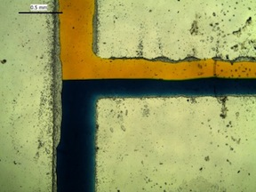
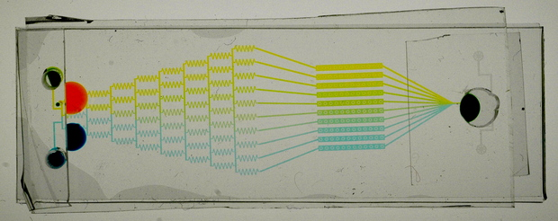
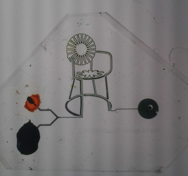

[TOC]

_Written by Jennifer Gilbertson, Anne Lynn Gillian-Daniel, Melissa Hemling, George Lisensky
Materials Research Science and Engineering Center, University of Wisconsin-Madison, Madison, WI 53706
Department of Chemistry, Beloit College, Beloit, WI 53511_

Microfluidics is the science and technology of systems that process or manipulate small quantities of fluids using channels with dimensions of tens to hundreds of micrometers1.  At the macroscopic scale, fluids mix through turbulent flow such as that seen when a drop of food coloring is added to water.  At the microscopic scale inertia is less important than viscosity so two fluid streams will flow side-by-side, moving smoothly in parallel, a process known as laminar flow.  In laminar flow the two fluids mix only by diffusion across the interface. 

The ability of microfluidic channels to use very small quantities of reagents provides an advantage in applications involving chemical synthesis and analysis, as well as sample detection with high sensitivity2. Microfluidics devices are used in a wide variety of applications including inkjet printers, immunoassays, medical diagnostics, environmental monitoring and chromatography.  For example, acid-base titrations that use only 1 mL of solution can be done in a microfluidic device by varying flow rate of the sample and titrant 3. 

Many microfluidic devices are prepared using photolithography to etch silicon or glass. In photolithography, ultraviolet light is used to transfer a geometric pattern to a light sensitive chemical called a photoresist that is coated on a substrate.  After a series of chemical treatments, the pattern is engraved onto the substrate creating a negative of the micro-sized channels of the device that serves as the stamp or template for the microfluidic device. Once the template is created, a layer of poly(dimethylsiloxane) (PDMS) is poured onto the mask and allowed to polymerize. 4  PDMS is non-toxic and safe for use in the classroom. 

A microfluidic pattern in the shape of the chairs found on the UW Memorial Union terrace.

## CITATION

1.	Whitesides, G. M. The origins and the future of microfluidics. Nature 2006, 442, 368-373.
2.	Weibel, D.; Whitesides, G. M. Applications of microfluidics in chemical biology. Current Opinion in Chemical Biology 2006, 10, 584-591
3.	Greener, J.; Tumarkin, E.; Debono, M.; Dicks, A.; Kumacheva, E. Education: a microfluidic platform for university-level analytical chemistry laboratories. Lab on a Chip 2012, 12, 696-701. 
4.	 Tang, S. K. Y.; Whitesides, G. M. Basic Microfluidic and Soft Lithographic Techniques, in Optofluidics: Fundamentals, Devices and Applications, Fainman, Y.; Lee, L.; Psaltis, D.; Yang, C. Eds., McGraw-Hill, 2010, chapter 2.
5.	McDonald, J. C.; Whitesides, G. M. Poly(dimethylsiloxane) as a Material for Fabricating Microfluidic Devices. Acc. Chem. Res. 2002, 35, 491-499.

