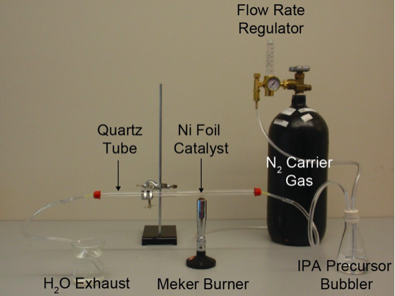
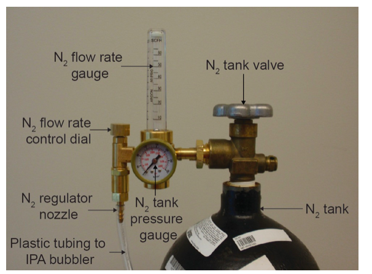
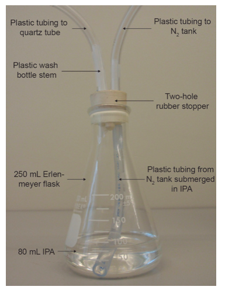
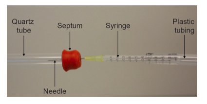

[TOC]

Graphene’s unique combination of exceptional mechanical, electronic, and thermal properties makes this material a promising candidate to enable next-generation technologies in a wide range of fields, including electronics, energy, and medicine. However, educational activities involving graphene have been limited due to the high expense and complexity associated with fabricating and characterizing graphene. Here, we demonstrate an economical, safe, and simple technique to synthesize multilayer graphene films via chemical vapor deposition in 30–45 min in a classroom setting. Raman spectroscopy indicates that the graphene is of high quality, scanning electron microscopy shows that the films are continuous over large areas, and oxidation studies demonstrate graphene’s high impermeability. The films are also transferred to insulating, optically transparent substrates, which enables measurement of the high electrical conductivity of graphene and direct visualization of several layers of atoms. This graphene synthesis has been successfully implemented in diverse settings with students ranging in education level from 5th grade to undergraduate. In addition to reinforcing fundamental concepts at the core of chemical education, this experiment introduces students to cutting-edge nanotechnology research.

## SAFETY

* Wear Eye Protection

* Chemical gloves recommended

## HAZARDS

Although this laboratory is safer than typical procedures used to grow graphene in research laboratories, there are associated hazards. Gloves and eye protection should be worn. Material safety data sheets for acetic acid, IPA, and FeCl3 should be consulted before using these chemicals. Care must be taken when using sharp needles to avoid puncturing oneself and the needles must be disposed of properly. If the N2 is introduced into the system too rapidly, the needles may eject from the quartz tube. Caution should be used when operating the Meker burners, which output a hotter flame than typical Bunsen burners by about 200 °C. The flame should not be unattended and a fire extinguisher should be in close proximity. Glass tubes should not be used to replace quartz tubes because glass is less stable and less resistant to cracking at the high temperatures used during synthesis.

Hexamethylenetetramine (HMT), zinc nitrate hexahydrate, and zinc sulfate monohydrate in their powder form may cause irritation to the skin and eyes on contact. An adult should carefully handle the powders inside a chemical fume hood or in a well-ventilated area. Students should wear goggles and gloves at all times during this experiment. The reaction vials should be handled carefully with heat resistant gloves after heating in the microwave oven to avoid burns. Compressed air contains difluoroethane (CAS 73-37-6), which is flammable and can be harmful if high concentrations of gas are inhaled. In order to ensure that the vials used in the experiment are safe when heated in the microwave, only the Borosilicate Glass with Phenolic Screw Cap Vials from VWR should be used (VWR Catalog No. 66011-121). Other types of vials have not been tested and may melt or break during the procedure. In addition, an adult should supervise students during the microwave heating. Multiple reactions can be done in a single microwave oven (see Supporting Information for adjustments to heating time and power), and the authors recommend that an adult be in charge of the heating.

## MATERIALS
Below is a list of the materials used in our experiments. Using alternate supplies is not recommended. If alternate supplies are used, specifications should be the same as the materials listed below to ensure successful growth of high-quality continuous graphene.

**Additional notes:** Some materials, such as the fused quartz tubing, Meker burner, polyvinyl chloride tubing, Erlenmeyer flask, two-hole rubber stopper, wash bottle, gas regulator, and barbed crosses/tees can be reused and will never need to be purchased again unless they break. The N2 tank can be rented from a local gas supplier. The cost of renting an N2 tank will vary by supplier; in our case, an industrial-grade N2 tank was available for $10.99 per month. The minimum order quantity of some materials, like Parafilm and Ni foil, is considerably more than what is needed for > 300 experimental setups. Other materials, such as the IPA, vinegar or acetic acid, Parafilm, plastic tubing, Erlenmeyer flask, and wash bottle are common supplies and may already be readily available to chemical educators. While some materials, like the septum stopper, needles, and syringes, may be reused, we recommend that they be disposed after each synthesis. Reusing these items increases the risk of forming leaks. The barbed cross and tee are only required if multiple experimental systems are connected in parallel.

## PROCEDURE

[Video of Lab](http://chemistry.beloit.edu/Edetc/nanolab/graphene/index.html)

This laboratory experiment (excluding the graphene transfer) takes 30-45 min. The list of materials and their corresponding quantity per experimental setup is provided below. Wear gloves and eye protection at all times during the experiment.

Ni foil preparation: Cut a square 1 cm2 piece of Ni foil with scissors and submerge the sample in glacial acetic acid for 5 min to etch the oxide from the Ni surface. White vinegar can be used instead of acetic acid if the etching time is extended to overnight. After etching, dry the Ni foil with a cloth or stream of air and flatten it between two flat, clean surfaces, such as microscope slides. Maintaining the Ni foil as flat as possible throughout the experiment helps ensure uniform graphene growth and successful transfer of the graphene film to an optically transparent substrate after synthesis. Warning: Consult the material safety data sheet for acetic acid before using this chemical.

N2 tank assembly: Connect the gas regulator to the N2 tank with a wrench. This connection is shown in Supplementary Fig. S1. At this point in the procedure, keep the N2 tank valve and the N2 flow rate control dial closed (turned completely clockwise) Warning: Never open the N2 tank valve without securely attaching the regulator or else high pressure gas will rapidly expel from the N2 tank. In addition to the dangers associated with the high velocity of the N2 stream, the N2 gas displaces O2 in the air, which may result in suffocation. Also, securely support the N2 tank to a stable fixture; do not leave it freestanding.

IPA precursor bubbler assembly: Add 80 mL of isopropanol (IPA) to a 250 mL Erlenmeyer flask. Cut the stem of a wash bottle into two straight segments of roughly equal length. Push these stems into the holes of a two-hole rubber stopper. Attach a piece of plastic tubing to one of the stems such that the tubing is fully submerged in the IPA when the two-hole rubber stopper seals the Erlenmeyer flask. The N2 will be supplied to the bubbler via this stem, which is called the supply stem. The N2/IPA vapor above the IPA liquid will flow out of the bubbler through the other stem, which is called the exhaust stem. Seal the Erlenmeyer flask with the two-hole rubber stopper. Use a second piece of plastic tubing to connect the top of the supply stem to the nozzle of the N2 regulator as shown in Supplementary Figs. S1 and S2. It is important to use plastic tubing with inner diameter of approximately 6.4 mm (0.25 inches) throughout this procedure. Otherwise, the flow rates provided here will need to be adjusted to account for the difference in diameter. Warning: Consult the material safety data sheet for IPA before using this chemical.

Reaction chamber assembly: Secure a quartz tube that is approximately 41 cm (16 inches) in length and has an inner diameter of 13 mm and outer diameter of 15 mm to a ring stand so that its long axis is parallel to the ground. Adjust the height of the quartz tube so that the Meker burner can be positioned approximately 1 cm below the quartz tube. Push a 1 mL syringe equipped with a needle [18 gauge and length of 3.8 cm (1.5 inches)] into the open end of a piece of plastic tubing. Connect the other end of the plastic tubing to the exhaust straw of the IPA precursor bubbler. Fit a 1.25 cm rubber septum snugly into the quartz tube. Puncture the center of the septum with the needle so that most of the needle is inserted into the quartz tube. This connection is shown in Supplementary Fig. S3. It is critical that the septum fits tightly into the quartz tube so that no O2 or H2O from the air diffuses into the system during the reaction.

Insert the Ni foil into the open end of the quartz tube and place it > 10 cm from the end of the quartz tube. Push a 1 mL syringe equipped with a needle [18 gauge and length of 3.8 cm (1.5 inches)] into the open end of a piece of plastic tubing. Place the other end of the plastic tubing into a beaker filled with H2O, which is where the N2/IPA vapor will be exhausted. Fit a 1.25 cm rubber septum snugly into the open end of the quartz tube. Puncture the center of the septum with the needle so that most of the needle is inserted into the quartz tube. Ensure that the Ni foil is still positioned > 10 cm from the end of the quartz tube. If the Ni foil is too close to the needle, the needle will become hot during the graphene synthesis and the plastic syringe may melt. 

Multiple experimental setups can be assembled in series or in parallel. In series, the quartz tubes are connected together so that the exhaust stream of an upstream experimental setup is the supply stream of a downstream experimental setup. In this configuration, each experimental setup receives the same stream of gas flow. Also, the H2O exhaust beaker is only needed after the most downstream experimental setup. The main advantage of connecting the setups in series is that no gas flow splitter is needed. The primary disadvantage of connecting the setups in series is that a leak in an upstream experimental setup will also introduce a leak into every setup located downstream, which detrimentally affects the graphene coverage and quality. Therefore, the successful synthesis of graphene in a downstream experimental setup critically depends on the construction of all setups that are located upstream.

On the other hand, in parallel, the gas stream is split to each system so that each experimental setup receives an independent gas stream. We recommend that the flow is split between the IPA precursor bubbler and the upstream end of each experimental system so that only one IPA precursor bubbler is needed to accommodate all setups. The main advantage of connecting the setups in parallel is that each tube receives its own gas stream; so this method is more likely to produce high-quality graphene than the series connection. The main disadvantage of connecting the setups in parallel is that gas flow splitters (crosses and/or tees) are needed. However, these items are only $0.44 apiece, as listed below.

Warning: Do not use a glass tube for the reaction chamber instead of a quartz tube because glass is less stable and less resistant to cracking at the high temperatures used during synthesis. Be careful when using sharp needles to avoid puncturing oneself and dispose of the needles properly.

Leak prevention: Wrap all connections with Parafilm to prevent diffusion of O2 and H2O from the air into the reaction vessel. These connections include the nozzle of the gas regulator with the plastic tubing, the plastic tubing with both the supply and exhaust stems, the two-hole rubber stopper with the Erlenmeyer flask, the plastic tubing with both syringes, and the septa with both ends of the quartz tube. Hose clamps can additionally be used at appropriate junctions to further prevent leaks.

Gas flow introduction: Now, introduce the N2 flow into the system with the gas flow regulator (Supplementary Fig. S1). Ensure that the N2 flow rate control dial is closed (turned completely clockwise). Open the N2 tank valve by turning the valve counterclockwise. The N2 tank pressure gauge reading should increase. If the gauge still reads 0 psi, the N2 tank is empty. In order to introduce N2 into the reaction chamber, slowly open the N2 flow rate control dial by turning it counterclockwise. The flow of N2 through the system is indicated by the presence of bubbles in the IPA precursor bubbler and in the H2O exhaust beaker. Adjust the flow rate control dial to maintain a flow rate of 3 bubbles/second. The flow rate can be measured by counting the number of bubbles through the IPA bubbler or H2O exhaust over a given time span. The flow rate measured in the IPA bubbler and in the H2O exhaust should be nearly equal. If they are not the same, there is a leak between the IPA bubbler and H2O exhaust that must be repaired before beginning the graphene synthesis. In order to repair leaks, ensure that all connections are tightly secured into position and apply more Parafilm to the connections. 

Warning: Introduce the N2 flow gradually by slowly opening the N2 flow rate control dial to prevent the needles from expelling from the septa.

System purge: Purge the system with the N2/IPA flow for 5 min. During this time, ensure that the flow rate remains stable at > 3 bubbles/second. If it does not, adjust the flow rate with the flow rate control dial until the flow rate stabilizes. If the flow rate is < 1 bubble/second, the system will not be at a sufficient overpressure to prevent O2 and H2O from the air from diffusing into the system, which will oxidize the Ni foil and inhibit high-quality graphene growth. If a flow rate > 3 bubbles/second is used, it is less likely that O2 and H2O will diffuse into the system; however the multilayer graphene film will be thicker because more IPA precursor will be introduced.

H2O vapor desorption: After purging the system for 5 min and letting the gas flow rate stabilize, ignite the Meker burner. In order to achieve the maximum temperature, rotate the shaft of the burner such that the holes at the base of the burner are aligned. Quickly move the burner along the entire length of the quartz tube for several seconds to remove H2O adsorbed to the inside of the tube. This H2O desorption is observable by eye. While sweeping the flame, do not expose the Ni foil to the flame for more than 1 second to ensure that graphene growth is not initiated. Also, do not expose the ends of the quartz tube to the flame for more than 1 second to ensure that the needles to not overheat, which can melt the syringes.

Warning: Be careful when operating the Meker burner, which outputs a hotter flame than typical Bunsen burners. Never leave the flame unattended and locate the nearest fire extinguisher in advance.

Graphene synthesis: Once the H2O stops visibly desorbing from the quartz tube, place the flame of the Meker burner approximately 1 cm (the hottest part of the flame) directly under the Ni foil to begin the graphene synthesis. The Meker burner must be used because it is able to reach a sufficiently high temperature of 550-600 °C to ensure high-quality graphene growth. Typical Bunsen burners only reach 350-400 °C. Allow the reaction to proceed for 5-10 min. In order to terminate growth, extinguish the Meker burner by turning off its gas source. Allow the quartz tube to cool for 3-5 min. After the quartz tube has cooled, close the N2 tank valve by turning the valve clockwise to stop the gas flow. Close the flow rate control dial by turning the dial clockwise. Disassemble the setup and carefully remove the Ni foil, which should now be coated with graphene. The graphene-coated Ni foil should be grey, like in Fig. 2a of the main text. If it is a different color, such as red, green, yellow, or blue like in Fig. 3b of the main text, the Ni foil probably oxidized during the synthesis and graphene most likely did not grow. This oxidation is a result of a leak into the system, either due to a low N2 flow rate < 1 bubble/second or a poorly sealed apparatus.

The oxidation rate of graphene-coated Ni foil is compared with that of bare Ni foil to confirm the presence of graphene and to demonstrate the high impermeability of graphene. Graphene-coated Ni foil (Fig. 2a) and bare Ni foil (Fig. 3a) are placed in the quartz reaction tube, which is kept open to atmosphere. The samples are heated with the Meker burner to 550 °C. After 2-5 min, the flame is turned off and the samples are inspected. The bare Ni foil oxidizes rapidly, turning different colors as the oxide thickness increases, as shown in Fig. 3b, until eventually turning green as the oxide reaches a critical thickness. In contrast, the graphene-coated Ni foil remains grey (Fig. 3c), indicating that the underlying Ni foil is protected by the graphene and, therefore, oxidizes to a lesser extent. This high impermeability of graphene makes it an excellent diffusion barrier.

The reaction conditions provided in the detailed experimental procedure above consistently result in the growth of high-quality, continuous graphene that fully covers the entire Ni foil substrate. Other growth conditions were attempted in which the growth time, precursor concentration, catalyst type, flow rate, and carrier gas were changed independently. All growth conditions are summarized below.

Graphene transfer: In order to transfer the multilayer graphene film from the Ni foil to an insulating, optically transparent substrate, cut a square 4 cm2 piece of polyethylene terephthalate (PET) with scissors. Heat the PET to 95 ˚C on a hot place for 5 min. Trim approximately 1 mm off the edges of the graphene-coated Ni foil. Flatten the graphene-coated Ni foil between two glass microscope slides and then place it on one of the microscope slides. Place the hot PET on top of the graphene. Next, place the glass slide, graphene-coated Ni foil, and PET on top of the hot plate at 95˚C. Apply pressure to the PET/graphene-coated Ni foil stack by rolling a glass stirring rod over the PET for 5 min. Allow the stack to sit on the hot plate at 95 °C for another 5 min. Turn off the hotplate and cool the sample for 5 min. Remove the glass slide from the PET/graphene-coated Ni foil. Gently scratch the exposed side of the Ni foil to remove graphene from that side of the Ni foil. This allows the Ni etchant to reach the Ni foil more easily. Float the PET/graphene-coated Ni foil stack on 1.0 M FeCl3 to dissolve the Ni foil. After etching the Ni foil for several hours, the multilayer graphene film remains on PET. Remove the sample from FeCl3 and rinse the sample with H2O. Dry the sample with a cloth or stream of air. The graphene transferred on PET is shown in Fig. 3d of the main text

Warning: Consult the material safety data sheet for FeCl3 before using this chemical.

Electrical measurements: The electrical resistance of graphene and PET can be compared after transfer of the graphene to the insulating PET substrate. Place both of the multimeter probe tips on the PET substrate. The resistance should be > 106 Ohms. Then, place both of the probe tips spaced approximately 1 mm apart on the multilayer graphene. The resistance should be 1000-5000 Ohms, considerably less than that of the PET substrate. If the graphene resistance is high, press the probe tips more firmly into the graphene. Ensure that the probe tips are not touching each other during the measurement.

## ELEMENTS

**Teaching Elements Used:**

Inquiry elements can be added to this laboratory experiment by allowing students to predict and test the effect of multiple CVD parameters on the graphene growth. The graphene synthesis consists of many elementary processes that occur throughout growth (Fig. 4), including (1) adsorption of IPA onto the Ni surface, (2) decomposition of IPA on the Ni surface to form C atoms, (3) dissolution of C atoms into the Ni bulk, (4) supersaturation of the Ni bulk, (5) precipitation of C from the Ni bulk to the Ni surface, (6) diffusion of C on the Ni surface, (7) nucleation of graphene islands from the C on the surface, and (8) attachment of C to the existing graphene islands.6, 7, 11, 12 These processes are governed by basic chemistry concepts, such as adsorption, solubility, decomposition, precipitation, oxidation, reaction kinetics and thermodynamics, crystal nucleation and growth, phase diagrams, and vapor pressure, and can be manipulated by changing the CVD conditions to affect the graphene growth rate and coverage. For example, by considering reaction thermodynamics and kinetics, students can predict how changing the growth temperature, precursor flow rate, and precursor concentration will affect the reaction rate. We find that with increasing temperature, increasing flow rate, and increasing precursor composition, the reaction proceeds faster and, consequently, after a given reaction time, the graphene coverage on the Ni surface is higher.

Growth time: We found that the graphene coverage increased with increasing growth time. Growth times between 10 seconds and 30 seconds yielded graphene with incomplete coverage; whereas increasing the growth time to > 1 min resulted in full graphene coverage.
Precursor concentration: We found that for a given growth time, the graphene coverage decreased with decreasing IPA concentration. IPA concentrations between 50% and 100% yielded full graphene coverage after growth time of 5 min. However, with IPA concentrations of 25% and 10%, incomplete graphene coverage resulted after 5 min. Full graphene coverage could be obtained with the 25% and 10% IPA solutions by increasing the growth time to 20 min. IPA was diluted with H2O.
Catalyst type: Whereas Ni was a suitable catalyst for growth of high-quality, continuous multilayer graphene, Cu and Al were not. Cu resulted in deposition of amorphous carbon and Al melted during the synthesis. 
Flow rate: Maintaining a flow rate > 3 bubbles/second resulted in growth of high-quality, continuous multilayer graphene films. As the flow rate increased, the thickness of the multilayer graphene increased. Using too low of a flow rate, specifically < 1 bubble/second, resulted in no growth due to oxidation of the Ni foil. At such low flow rates, there is an insufficient overpressure in the growth apparatus, allowing O2 and H2O vapor from the air to diffuse into the system. We found that using 3 bubbles/second was a good balance between reproducible graphene growth and decreased film thickness.
Carrier gas: In addition to N2, He was used as a carrier gas. We recommend using N2 as a carrier gas because it is less expensive than He.

## CITATIONS
From the paper Simple Graphene Synthesis via Chemical Vapor Deposition, J. Chem. Educ., 2015, 92 (11), pp 1903–1907
Authors: Robert M. Jacobberger1‡, Rushad Machhi2‡, Jennifer Wroblewski2, Ben Taylor2, Anne Lynn Gillian-Daniel2*, Michael S. Arnold1*

1. Department of Materials Science and Engineering, University of Wisconsin-Madison, Madison, Wisconsin 53706, United States
2. Interdisciplinary Education Group, Materials Research Science and Engineering Center, University of Wisconsin-Madison, Madison, Wisconsin 53706, United States

‡These authors contributed equally to this work.
*e-mail: agillian@wisc.edu, msarnold@wisc.edu
