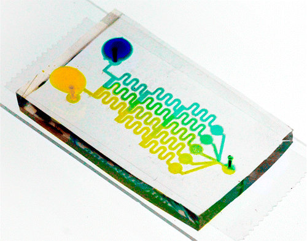
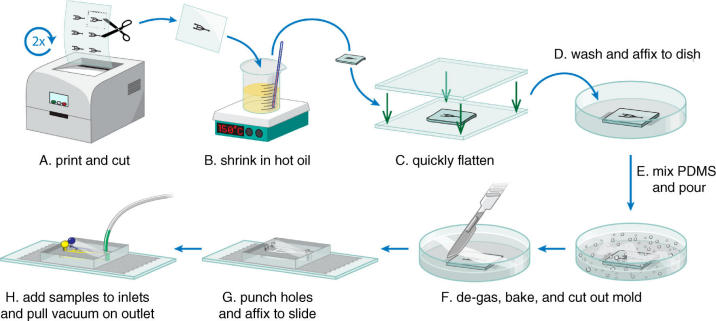
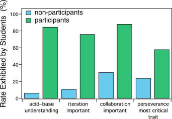

[TOC]

_Written by Melissa Hemling, John A. Crooks, Piercen M. Oliver, Katie Brenner,ennifer Gilbertson, George C. Lisensky, and Douglas B. Weibel_

http://pubs.acs.org/doi/abs/10.1021/ed4003018

## ABSTRACT

We present a laboratory experiment that introduces high school chemistry students to microfluidics while teaching fundamental properties of acid−base chemistry. The procedure enables students to create microfluidic systems using nonspecialized equipment that is available in high school classrooms and reagents that are safe, inexpensive, and commercially available. The experiment is designed to ignite creativity and confidence about experimental design in a high school chemistry class. This experiment requires a computer program (e.g., PowerPoint), Shrinky Dink film, a readily available silicone polymer, weak acids, bases, and a colorimetric pH indicator. Over the span of five 45-min class periods, teams of students design and prepare devices in which two different pH solutions mix in a predictable way to create five different pH solutions. Initial device designs are instructive but rarely optimal. During two additional half-class periods,
students have the opportunity to use their initial observations to redesign their microfluidic systems to optimize the outcome. The experiment exposes students to cutting-edge science and the design process, and solidifies introductory chemistry concepts including laminar flow, neutralization of weak acids−bases, and polymers.

**Keywords**:  High School/Introductory Chemistry, Laboratory Instruction, Collaborative/Cooperative Learning,
Inquiry-Based/Discovery Learning, Hands-On Learning/Manipulatives, Problem Solving/Decision Making, Acids/Bases,
Aqueous Solution Chemistry, Liquids, Microscale Lab
Microfluidic devices are used in many scientific disciplines
to explore questions that may only be addressed by
precise control of fluids at small length scales.1 Researchers use microfluidics to manipulate chemicals and cells at size scales that are otherwise inaccessible. Experiments with microfluidics are revolutionizing our understanding of cell biology and fluid physics, as well as drug discovery. Beyond research, micro- fluidics is an enabling technology that has spawned companies that manufacture a range of products from diagnostic devices to inkjet printers. Inspired by its broad utility, we set out to make microfluidic technology accessible to students in a high school chemistry class. Microfluidic devices can be prepared using a variety of techniques and materials; however, one of the most common methods of creating microfluidic systems requires preparing a mold in a clean-room using a photolithography step, followed by curing a polymer in the mold to form the device. Photolithography is currently impractical for high school laboratories; however, a variety of alternative techniques have been described that simplify the fabrication of microfluidic devices by eliminating the use of photolithography. 2−4 For example, Shrinky Dink film has been used to create molds for
imprinting microfluidic designs into elastomeric polymers.5,6 Here, the experimenter prints a large design (on the order of several millimeters) onto the Shrinky Dink film using a conventional laser printer, and, upon heat treatment, the shrink film polymer contracts, reducing the size of the printed design to a scale of several hundred micrometers. We extended this approach to the high school laboratory because (1) high school students are captivated by the material properties of the shrinkable polystyrene film, (2) the material is inexpensive, (3) the approach can create complex microfluidic systems, and (4) the process uses equipment available in most high schools. The adaptations we implemented enabled high school students to create multiple microfluidic devices and engineer their designs toward optimization over five 45-min class periods. Polydimethylsiloxane (PDMS) is a silicon-based elastomeric
organic polymer with a range of properties that have
encouraged its use in microfluidic design; it is inert, nontoxic, transparent, biocompatible, inexpensive, and easy to handle. After mixing two liquid precursors together, the PDMS prepolymer can be poured on a mold containing the
microfluidic pattern and polymerized using heat. The PDMS microfluidic system is released from the mold after curing.
PDMS-based microfluidic devices may be designed, created,
and tested within a span of several hours,7 which is compatible with high school chemistry lab schedules. However, manufacturing microfluidic molds to pattern PDMS is a major barrier to creating microfluidic systems because the sophisticated methods most frequently used to make the molds are not feasible in high school laboratories. We developed a fast, inexpensive, and reproducible method for preparing micro-fluidic molds using Shrinky Dink film, adapted all of thetechniques used to make PDMS-based microfluidic devices to the high school classroom, and used the experiment to teach acid−base chemistry early in a first-year high school chemistry curriculum in a public high school

_
Figure 1. Fabrication and operation of the microfluidic device. (A) A microfluidic design is double printed (approximately 1.6× larger than the final desired dimensions) onto Shrinky Dink film using a laser printer. (B) The printed patterns are cut to size and submerged in hot oil (150 °C) until
the film shrinks completely (30−60 s). (C) The shrunken design is removed quickly from the oil and gently flattened between two glass plates. (D)The cleaned and dry design is taped to the bottom of a Petri dish,  and (E) PDMS elastomer is poured in the dish to completely cover the design. (F) A vacuum pump is used to degas the PDMS elastomer before it is cured in a 60 °C oven overnight. (G) Once the PDMS has fully cured, the microfluidic device is cut to the desired size using a razor. Inlets and outlets are created using a biopsy punch, and the final device is assembled by attaching the PDMS device to a glass slide with double-sided tape. (H) Liquid samples are added to the device (shown here as yellow and blue droplets covering the inlets) using a pipet. Flow is achieved by attaching a syringe to the outlet of the device using a short piece of flexible tubing. Gently pulling the syringe plunger creates a vacuum that draws the samples through the device toward the outlet_

## HAZARDS 
In the course of this experiment, students should wear
protective gloves and eyewear. Hot vegetable oil (150 °C)
must be treated with care as it can lead to serious burns. The beaker containing the oil should have capacity of at least 2× the necessary vegetable oil, and the beaker should be fully supported by a hot plate that is wider than the beaker circumference (Figure 1B). Student groups can also share a single, centralized heating station to minimize hazard. Acids and bases should be treated with care.

## OVERVIEW  
_Creating Polystyrene Molds_

Expensive instruments and hazardous materials make photolithography impractical for creating molds in high school labs. Instead, Shrinky Dink film (polystyrene plastic film) was used to create microfluidic molds.5 Students printed their device designs onto the polystyrene film using a standard laser printer, cut out rectangular sections containing their design with scissors, and applied heat to shrink the film (for detailed instructions and lesson plan, please see the Supporting Information). As the film shrinks, the lateral size of the pattern is reduced by ∼5/8, the height of the ink and the thickness of the polymer increases, and bas-relief features of ink form, whose height can range from approximately 50 to 100 μm.5 The previously developed procedure for preparing Shrinky Dink microfluidic devices 3,5,8 was modified, as we found that polystyrene film shrinks more rapidly and evenly when submerged in hot oil than when baked in an oven. After incubating the film for 30 s in a beaker containing vegetable oil warmed on a hot plate, students remove the film with forceps and press it gently between two glass plates to keep it flat as it cools and becomes stiff. The product of this process is a mold for preparing PDMS microfluidic devices using soft lithography
(Figure 1).

_Patterning PDMS Microfluidic Systems_

PDMS is an inert and rapidly cured polymer that is compatible with chemistry experiments performed in high school classrooms. Students weigh the two components in a disposable plastic cup (monomer and curing agent in a 10:1 ratio by mass), mix it with a plastic fork or wood stick, and pour it over the polystyrene molds, which are positioned with their ink basrelief structures face-up in a plastic Petri dish (150 × 15 mm) (Figure 1D,E). Several molds fit contiguously in each Petri dish, minimizing wasted PDMS. To remove air bubbles from the PDMS that arise during mixing, students degas the Petri dishes for 10 min using a vacuum pump and bell jar, and then incubate the Petri dishes containing PDMS-coated molds in a warm oven overnight to cure the polymer (Figure 1F). Alternatively, PDMS can be cured at room temperature for several days (e.g., over a weekend).

_Device Assembly_

Once cured, students peel the PDMS out of the Petri dishes,
separate them from the Shrinky Dink molds, and cut out
individual PDMS devices with a scalpel, razor blade, or pair of scissors (Figure 1F). Holes for the inlets and outlets of devices are created by punching through the PDMS with the metal tip of a thick-lead disposable mechanical pencil (pencil lead withdrawn) or with a biopsy punch for best results (Figure 1G). To enclose the microfluidics channels, students tightly seal the patterned PDMS layer against a solid, transparent material such as glass. In research laboratories, adhesion between the two layers is typically promoted by treating them with a plasma cleaner, which is incompatible with most high school laboratories. We explored approaches that would be feasible in a high school laboratory and found that a wide piece of double-sided transparent tape creates a reliable watertight seal between the PDMS microfluidic layer and a glass slide (Figure 1G). Finally, a small syringe is attached to the outlet hole(s) of
the assembled device through a short length of plastic tubing (Figure 1H). By drawing out the syringe plunger, students create suction that is sufficient to flow different solutions through the device, eliminating the need for electronically controlled pumps that are rarely found in a high school setting.

_Acid−Base Mixing Experiments_

Students prepare 100 mM solutions of NaH2PO4 (weak acid)
and Na2HPO4 (weak base) in distilled water and mix each with a drop of concentrated universal pH indicator solution. The students’ task is to create a microfluidic network that uses the weak acid and weak base solutions to generate five regions with different pH values (ranging from pH 1−2, 3−5, 6−8, 9−11, and 12−14) in a single device. One correct answer to the activity is presented in the graphical abstract (a description of how the device works is included in the Supporting Information). Using a thin-tipped transfer pipet, students deposit approximately 50 μL droplets of acid and base solutions on top of the appropriate inlets of their device. The surface energy of the PDMS causes a bead of the colored acid and base solutions to form on top of the PDMS device and remain positioned over the inlets (Figure 1H). Using small syringe(s) attached to the outlet(s) of their device, students draw the acid and base solutions through the device, observe any color changes, and record their results.

## DISCUSSION

The experiment lends itself to a team-based and inquiry-based pedagogical approach, as outlined fully in the Supporting Information. We introduced the experiment with a guided inquiry worksheet and premade devices (see the Supporting Information text and Microfluidics 101 Guided Inquiry for instructions) designed to introduce students to laminar flow. Students expected fluids flowing side-by-side to mix completely; however, in the laminar regime of microfluidic devices, fluids flow side-by-side while mixing only at their interface. When students observed that fluids flow side-by-side with minimal mixing in the premade devices, they were surprised. This motivated them to explore designs that facilitate mixing. Students then successfully answered a design challenge to construct a microfluidic device that combines two solutions, a weak acid and weak base, to create five regions with distinct pH values on a single microfluidic chip. At every step in the experiment, we found that when each student had an explicit hands-on role, they became readily engaged in the activity. Students worked in teams of three or four; however, each student designed an initial microfluidic device individually and
later independently redesigned the device that their team used in the first round (see the Supporting Information). At each round of designs, teams chose a single microfluidic design from those submitted by their teammates and created it. Students were highly motivated to redesign their devices, particularly when the whole class participated in testing all of the firstround devices, and a class discussion followed the testing. Students reported learning the most from watching device trials followed by participating in a collective problem-solving session. No microfluidic devices successfully generated all five pH values in the first round of design. After redesign and fabrication, over 50% of the second-round microfluidic designs were successful. We surveyed two independent classes of chemistry students
in the same school, with the same teacher for the same course (different semesters), who either participated (N = 52) or did not participate (N = 78) in the microfluidics experiment. Students who participated gained solid understanding of acid−base chemistry versus those students who did not participate: 6% vs 85%. Given the opportunity to write freely about the process of scientific discovery, 11% of the students who did not participate mentioned that trial and error or iteration are important to the process, whereas 76% of students who participated indicated that iterative improvement is involved in scientific discovery. Thirty-one percent of nonparticipating students mentioned collaboration as important to the scientific process, whereas 88% of the students who participated discussed the importance of collaboration in the scientific discovery process. Additionally, 76% of the nonparticipatory students chose intelligence as the most important trait of a scientist, whereas 58% of students who participated in the laboratory experiment chose perseverance over intelligence as a crucial trait of scientists (Figure 2).

_Figure 2. Summative assessment results. We surveyed two independent classes of chemistry students in the same school, with the same teacher for the same course (different semesters), who either participated (N = 52; labeled as participants) or did not participate (N = 78; labeled as nonparticipants) in the microfluidics experiment.
_

## CONCLUSION
Many high school students may never be exposed to cuttingedge science because their laboratories lack the appropriate equipment and supplies. As a result, students may perceive scientific processes as antiquated, and curricula may be irrelevant to contemporary science. The microfluidic experiment described in this manuscript addresses these limitations and provides an opportunity for a potentially transformative science education. Students design and assemble cutting-edge research tools using equipment available in a public high school. The process introduces students to the possibilities of invention and creativity in the context of their high school chemistry
classroom. This highly accessible laboratory experiment brings microfluidic devices to the chemistry classroom, and may also be used to teach concepts in biology and physics.9,10 This simple fabrication process may also find broad utility in extracurricular chemistry or engineering clubs and in public science demonstrations. Regardless of the teaching application, students participating in this microfluidic experiment gain confidence in the experimental design process and an understanding of the importance of perseverance toward a scientific goal.

## ASSOCIATED CONTENT

*Supporting Information: Additional background material is provided, as well as links to useful references and online videos. A detailed activity guide is provided for instructors and student instructions are provided for performing the experiment. A student worksheet and the answer key are also included for reference. This material is available via the Internet at http://pubs.acs.org

## AUTHOR INFO

Corresponding Author
*E-mail: weibel@biochem.wisc.edu.

Notes
The authors declare no competing financial interest.

## ACKNOWLEDGMENTS

This research was supported by the National Science
Foundation through the Materials Research Science and
Engineering Center on Structured Interfaces at the University of Wisconsin, Madison (DMR-1121288 and EEC-0908782) and the Camille and Henry Dreyfus Foundation (grant to D.B.W.). P.M.O. was supported by a postdoctoral fellowship from the National Science Foundation (#1202622). K.B. was supported by a postdoctoral fellowship from the Hartwell Family Foundation. Any opinions, findings, and conclusions or recommendations expressed in this report are those of the authors and do not necessarily reflect the views of the NSF.

## REFERENCES
1. Whitesides, G. M. The origins and the future of microfluidics. Nature 2006, 442, 368−73.
2.  Yuen, P. K.; Goral, V. N. Low-cost rapid prototyping of wholeglass microfluidic devices. J. Chem. Educ. 2012, 89, 1288−1292.
3. Chia, M. C.; Sweeney, C. M.; Odom, T. W. Chemistry in
microfluidic channels. J. Chem. Educ. 2011, 88, 461−464.
4. Cai, L.; Wu, Y.; Xu, C.; Chen, Z. A simple paper-based
microfluidic device for the determination of the total amino acidcontent in a tea leaf extract. J. Chem. Educ. 2013, 90, 232−234.
5. Grimes, A.; et al. Shrinky-Dink microfluidics: rapid generation of deep and rounded patterns. Lab Chip 2008, 8, 170−2.
6. Nguyen, D.; McLane, J.; Lew, V.; Pegan, J.; Khine, M. Shrink-film microfluidic education modules: Complete devices within minutes. Biomicrofluidics 2011, 5, 22209.
7. Xia, Y.; Whitesides, G. M. Soft lithography. Angew. Chem. 1998, 37, 550−575.
8. Greener, J.; Tumarkin, E.; Debono, M.; Dicks, A. P.; Kumacheva, E. Education: a microfluidic platform for university-level analytical chemistry laboratories. Lab Chip 2012, 12, 696−701.
9. Weibel, D. B.; Whitesides, G. M. Applications of microfluidics in chemical biology. Curr. Opin. Chem. Biol. 2006, 10, 584−91.
10. Squires, T. M.; Quake, S. R. Microfluidics: Fluid physics at the nanoliter scale. Rev. Mod. Phys. 2005, 77, 977−1026.

