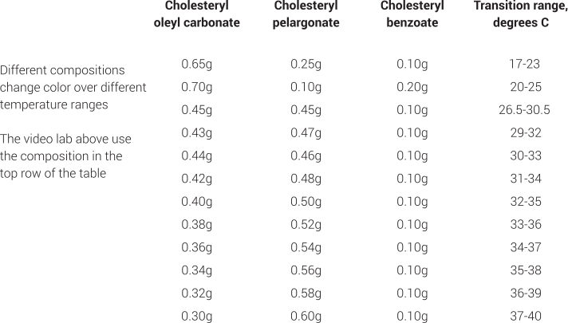

[TOC]

_Procedure based on G. H. Brown and J. J. Wolken, Liquid Crystals and Biological Systems, Academic Press, NY, 1979, pp. 165-167 and W. Elser and R. D. Ennulat, Adv. Liq. Cryst. 2, 73 (1976)._

One of the principal advantages of liquid crystals is their ability to map out thermal regions of different temperature. These cholesteric-nematic liquid crystals reversibly change color as the temperature changes. As long as the mixture is stored in a sealed container it can be prepared months in advance, although the sample may need to be remelted to mix.

## SAFETY

* Wear Eye Protection

## MATERIALS

Use these materials with normal chemical precautions. Solids should not be inhaled and contact with skin, eyes, or clothing should be avoided. Wash thoroughly after handling.
*	Cholesteryl oleyl carbonate, Aldrich 15,115-7
*	Cholesteryl pelargonate (Cholesteryl nonanoate), Aldrich 	C7,880-1
*	Cholesteryl benzoate, Aldrich C7,580-2
*	0.01 g balance, vials, heat gun or hair dryer

## PROCEDURE

* **Step 1.   **

	Place 0.65 g cholesteryl oleyl carbonate, 0.25 g cholesteryl pelargonate, and 0.10 g cholesteryl benzoate in a vial.
   
 
* **Step 2. **

  Melt the solid in a sample vial using a hair drier, heat gun, or oven.

* **Step 3. **

  While the mixture is still liquid, divide into several vials.

* **Step 4. **

   The product changes color as it cools. Different compositions change color over different temperature changes.

* **Step 5. **

	Touching the vial changes the temperature and results in color changes
    
    
    
    
    
  

